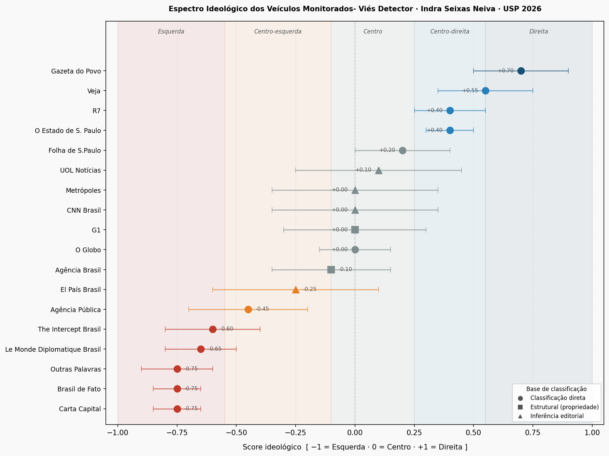

# 🗞️ Viés Detector — Detecção Automatizada de Viés Editorial em Notícias Brasileiras

[](https://python.org)
[](https://creativecommons.org/licenses/by/4.0/)
[](https://huggingface.co/neuralmind/bert-base-portuguese-cased)

Pipeline end-to-end para detecção e comunicação de viés editorial em veículos jornalísticos brasileiros, usando **BERTimbau** + **FactNews** + análise de espectro ideológico.

> Trabalho de Conclusão de Curso — Indra Seixas Neiva — USP (2026)

---

## 📐 Arquitetura em Camadas

```
┌─────────────────────────────────────────────────────────┐
│  Camada 1 · collector     RSS → metadados + SHA-256     │
│  Camada 2 · classifier    BERTimbau fine-tuned → rótulo │
│  Camada 3 · aggregation   sentenças → BiasScore [0,2]   │
│  Camada 4 · ideological   BiasScore → espectro [-1,+1]  │
└─────────────────────────────────────────────────────────┘
```

---

## 📁 Estrutura do Projeto

```
vies_detector/
├── collector/          # Camada 1 – Coleta e pré-processamento RSS
│   ├── __init__.py
│   ├── rss_fetcher.py
│   ├── deduplicator.py
│   ├── preprocessor.py
│   └── sources.py
├── classifier/         # Camada 2 – Classificação sentence-level
│   ├── __init__.py
│   ├── sentence_classifier.py
│   ├── model_loader.py
│   └── train.py
├── aggregation/        # Camada 3 – BiasScore por artigo e veículo
│   ├── __init__.py
│   ├── bias_score.py
│   └── window_aggregator.py
├── ideological/        # Camada 4 – Contextualização ideológica
│   ├── __init__.py
│   ├── spectrum.py
│   ├── reference_map.py
│   └── data/
│       └── ideological_references.json
├── pipeline/           # Orquestração (Prefect)
│   ├── __init__.py
│   └── main_flow.py
├── api/                # REST API Flask
│   ├── __init__.py
│   └── app.py
├── tests/              # Testes unitários
│   ├── test_collector.py
│   ├── test_classifier.py
│   ├── test_aggregation.py
│   └── test_ideological.py
├── scripts/
│   ├── setup_db.py
│   └── run_pipeline.py
├── docs/
│   └── architecture.md
├── .env
├── .gitignore
├── requirements.txt
├── pyproject.toml
└── README.md
```

---

## ⚡ Quickstart

```bash
# 1. Clone e instale dependências
git clone https://github.com/<seu-usuario>/vies-detector.git
cd vies-detector
python -m venv .venv && source .venv/bin/activate
pip install -r requirements.txt
python -m nltk.downloader punkt punkt_tab

# 2. Configure variáveis de ambiente
cp .env .env
# Edite .env com suas configurações

# 3. Inicialize o banco de dados
python scripts/setup_db.py

# 4. Execute o pipeline manualmente
python scripts/run_pipeline.py

# 5. Suba a API
python api/app.py
```

---

## 🤖 Treinamento do Classificador

```bash
# Faça download do FactNews https://github.com/franciellevargas/FactNews (VARGAS et al., 2023) e salve em data/factnews.csv

python classifier/train.py --data data/factnews.csv --output models/bertimbau-bias
```

Remapeamento para treino usando Pytorch:
| FactNews | Significado          | Índice PyTorch  | 
|----------|----------------------|-----------------|
|   – 1    | fortemente enviesada |      2          |
|     0    | factual              |      0          |
|     1    | enviesada            |      1          |

> O modelo treinado deve ser salvo em `models/bertimbau-bias/` e referenciado no `.env`.


---

## 🗺️ Veículos Monitorados e Posicionamento Ideológico

O sistema monitora **18 veículos** de mídia brasileira. O gráfico abaixo mostra o espectro completo — barras de erro indicam a incerteza de cada classificação; o marcador distingue a base (direta, estrutural ou inferência).



> Para regenerar o gráfico: `python scripts/generate_spectrum_chart.py`

O posicionamento de cada veículo é derivado de fontes acadêmicas independentes — não constitui julgamento do sistema. Veículos marcados com ⚠️ não possuem classificação direta nas fontes primárias e recebem incerteza máxima (±0.35).

**Esquerda** (score < −0.55)

| Veículo | Score¹ | Incerteza | Base | Fontes |
|---|:---:|:---:|:---:|---|
| [Brasil de Fato](https://www.brasildefato.com.br) | −0.75 | ±0.10 | Direta | Ortellado & Ribeiro (2018); Intervozes (2017) |
| [Outras Palavras](https://outraspalavras.net) | −0.75 | ±0.15 | Direta | Ortellado & Ribeiro (2018); Intervozes (2017) |
| [Carta Capital](https://www.cartacapital.com.br) | −0.75 | ±0.10 | Direta | Feres Júnior et al. (2013); Ortellado & Ribeiro (2018) |
| [Le Monde Diplomatique Brasil](https://diplomatique.org.br) | −0.65 | ±0.15 | Direta | Ortellado & Ribeiro (2018); Feres Júnior et al. (2013) |
| [The Intercept Brasil](https://theintercept.com/brasil) | −0.60 | ±0.20 | Direta | Ortellado & Ribeiro (2018) |

**Centro-esquerda** (−0.55 ≤ score < −0.10)

| Veículo | Score¹ | Incerteza | Base | Fontes |
|---|:---:|:---:|:---:|---|
| [Agência Pública](https://apublica.org) | −0.45 | ±0.25 | Direta | Ortellado & Ribeiro (2018) |
| [El País Brasil](https://brasil.elpais.com) | −0.25 | ±0.35 | ⚠️ Inferência | — |
| [Agência Brasil](https://agenciabrasil.ebc.com.br) | −0.10 | ±0.25 | Estrutural | Intervozes (2017) |

**Centro** (−0.10 ≤ score ≤ +0.25)

| Veículo | Score¹ | Incerteza | Base | Fontes |
|---|:---:|:---:|:---:|---|
| [O Globo](https://oglobo.globo.com) | 0.00 | ±0.15 | Direta | Feres Júnior et al. (2013); Intervozes (2017) |
| [G1](https://g1.globo.com) | 0.00 | ±0.30 | Estrutural | Intervozes (2017) |
| [CNN Brasil](https://www.cnnbrasil.com.br) | 0.00 | ±0.35 | ⚠️ Inferência | — |
| [Metrópoles](https://www.metropoles.com) | 0.00 | ±0.35 | ⚠️ Inferência | — |
| [UOL Notícias](https://noticias.uol.com.br) | +0.10 | ±0.35 | ⚠️ Inferência | — |
| [Folha de S.Paulo](https://www.folha.uol.com.br) | +0.20 | ±0.20 | Direta | Feres Júnior et al. (2013); Ortellado & Ribeiro (2018) |

**Centro-direita** (+0.25 < score ≤ +0.55)

| Veículo | Score¹ | Incerteza | Base | Fontes |
|---|:---:|:---:|:---:|---|
| [O Estado de S. Paulo](https://www.estadao.com.br) | +0.40 | ±0.10 | Direta | Feres Júnior et al. (2013); Ortellado & Ribeiro (2018) |
| [R7](https://noticias.r7.com) | +0.40 | ±0.15 | Direta | Ortellado & Ribeiro (2018); Intervozes (2017) |
| [Veja](https://veja.abril.com.br) | +0.55 | ±0.20 | Direta | Feres Júnior et al. (2013); Ortellado & Ribeiro (2018) |

**Direita** (score > +0.55)

| Veículo | Score¹ | Incerteza | Base | Fontes |
|---|:---:|:---:|:---:|---|
| [Gazeta do Povo](https://www.gazetadopovo.com.br) | +0.70 | ±0.20 | Direta | Ortellado & Ribeiro (2018) |

> ¹ Escala de −1.0 (progressista) a +1.0 (conservador). **Incerteza** (±) expressa a divergência entre as fontes — quanto maior, menos consenso acadêmico. **Base**: *Direta* = classificação explícita na fonte; *Estrutural* = inferida por propriedade/estrutura; *Inferência* = sem cobertura nas fontes primárias.

---

### Base Literária e Metodologia de Agregação

#### Fontes primárias utilizadas

| Fonte | Método | Peso | Cobertura |
|---|---|:---:|---|
| [**Manchetômetro** — Feres Júnior et al. (2013–)](http://www.manchetometro.com.br) | Análise de cobertura eleitoral; classificação por parcialidade editorial (IESP/UERJ) | 1.0 | Grandes jornais e revistas nacionais |
| [**Ortellado & Ribeiro (2018)**](https://gpopai.usp.br) — GPOPAI/USP | Análise de audiência cruzada com conteúdo editorial; survey de leitores | 1.0 | Jornais, revistas e portais digitais |
| [**Donos da Mídia** — Intervozes (2017)](https://donosdamidia.com.br) | Mapeamento de propriedade e concentração dos grupos de comunicação | 0.8 | TV, rádio, jornais e portais |

> O peso menor do Intervozes (0.8) deve-se ao seu foco em estrutura de propriedade — e não em análise direta de conteúdo editorial — o que o torna menos preciso para classificação ideológica do que os outros dois.

#### Fórmula de cálculo

O score de cada veículo é calculado por **média ponderada** das classificações normalizadas:

```
Score = Σ(wᵢ × sᵢ) / Σwᵢ
Incerteza = desvio-padrão(sᵢ)
```

**Tabela de normalização** — classificações nominais convertidas para escala [−1, +1]:

| Classificação original | Score normalizado |
|---|:---:|
| Esquerda | −0.75 |
| Centro-esquerda | −0.35 |
| Centro | 0.00 |
| Centro-direita | +0.40 |
| Direita | +0.70 |

**Exemplo completo — Folha de S.Paulo:**

| Fonte | Classificação | Score norm. | Peso (wᵢ) | wᵢ × sᵢ |
|---|---|:---:|:---:|:---:|
| Feres Júnior / Manchetômetro | Centro-direita | +0.40 | 1.0 | +0.40 |
| Ortellado & Ribeiro | Centro | 0.00 | 1.0 | 0.00 |
| **Score agregado** | | | Σw = 2.0 | **0.40 / 2.0 = +0.20** |
| **Incerteza** | | | | **std(0.40; 0.00) = ±0.20** |

**Exemplo completo — Estadão (consenso total):**

| Fonte | Classificação | Score norm. | Peso (wᵢ) | wᵢ × sᵢ |
|---|---|:---:|:---:|:---:|
| Feres Júnior / Manchetômetro | Centro-direita | +0.40 | 1.0 | +0.40 |
| Ortellado & Ribeiro | Centro-direita | +0.40 | 1.0 | +0.40 |
| **Score agregado** | | | Σw = 2.0 | **0.80 / 2.0 = +0.40** |
| **Incerteza** | | | | **std(0.40; 0.40) = ±0.00 → piso ±0.10** |

#### Justificativa metodológica

> *"O score ideológico de cada veículo foi obtido por agregação meta-analítica de classificações independentes, convertidas para escala comum [−1, +1] e ponderadas pelo rigor metodológico de cada fonte. A incerteza associada a cada score expressa a divergência entre as fontes — veículos com maior consenso acadêmico têm incerteza menor. Essa abordagem segue o princípio de triangulação metodológica (DENZIN, 1978) e é análoga à síntese de evidências proposta por Groseclose & Milyo (2005) para mensuração de viés em mídia."*

#### Referências completas

- **FERES JÚNIOR, J. et al.** Manchetômetro: monitoramento do noticiário político na mídia brasileira. IESP/UERJ, 2013–. Disponível em: [http://www.manchetometro.com.br](http://www.manchetometro.com.br)

- **ORTELLADO, P.; RIBEIRO, M. M.** Estamos todos desinformados? GPOPAI — Grupo de Pesquisa em Políticas Públicas para o Acesso à Informação, USP, 2018. Disponível em: [https://gpopai.usp.br](https://gpopai.usp.br)

- **INTERVOZES — Coletivo Brasil de Comunicação Social.** Donos da Mídia: mapeamento da propriedade dos meios de comunicação no Brasil. São Paulo: Intervozes, 2017. Disponível em: [https://donosdamidia.com.br](https://donosdamidia.com.br)

- **GROSECLOSE, T.; MILYO, J.** A Measure of Media Bias. *The Quarterly Journal of Economics*, v. 120, n. 4, p. 1191–1237, 2005. DOI: [10.1162/003355305775097542](https://doi.org/10.1162/003355305775097542)

- **DENZIN, N. K.** *The Research Act: A Theoretical Introduction to Sociological Methods.* 2. ed. New York: McGraw-Hill, 1978.

---

## 📊 BiasScore

O BiasScore mede a **intensidade média de viés** de um artigo, ponderando cada sentença pelo grau de enviesamento detectado pelo classificador:
Sentenças factuais têm peso 0 e não elevam o score. O resultado varia de **0** (totalmente factual) a **2** (totalmente fortemente enviesado).

### Exemplo — artigo com 10 sentenças

| Composição                                      | Cálculo             | BiasScore |
|-------------------------------------------------|---------------------|-----------|
| 10 factuais                                     | (0 + 0) / 10        | 0.0       |
| 8 factuais · 2 enviesadas                       | (2×1 + 0) / 10      | 0.2       |
| 6 factuais · 4 enviesadas                       | (4×1 + 0) / 10      | 0.4       |
| 4 factuais · 4 enviesadas · 2 fort. enviesadas  | (4×1 + 2×2) / 10    | 0.8       |
| 10 fortemente enviesadas                        | (0 + 10×2) / 10     | 2.0       |

### Interpretação das faixas

| Faixa      | Interpretação                                                                 |
|------------|-------------------------------------------------------------------------------|
| 0.0 – 0.4  | Factual — poucas sentenças enviesadas, intensidade leve     |
| 0.4 – 0.8  | Viés moderado — presença notável de sentenças enviesadas                      |
| 0.8 – 1.4  | Viés elevado — mistura significativa de enviesadas e fortemente enviesadas    |
| 1.4 – 2.0  | Linguagem fortemente enviesada — alta concentração de conteúdo carregado      |

> **Nota:** o BiasScore é uma estimativa probabilística baseada nos padrões aprendidos pelo modelo sobre o FactNews. Não representa um julgamento objetivo sobre a qualidade ou a veracidade do veículo.
 
---


## ⚠️ Limitações e Uso Responsável

- O BiasScore é uma **estimativa probabilística**, não um julgamento objetivo.
- O modelo aprende padrões dos anotadores do FactNews, que possuem perspectivas teóricas próprias.
- Risco de *shortcut learning*: menção de certos termos políticos pode inflar o score.
- Não utilize esta ferramenta para deslegitimar veículos de comunicação.

---

## 📜 Referências Principais

- SOUZA et al. BERTimbau (2020)
- VARGAS et al. FactNews (2023)
- ENTMAN, R. Framing Theory (1993)
- GEIRHOS et al. Shortcut Learning (2020)

---

## Licença

© Indra Seixas Neiva — USP 2026
"# vies-detector" 